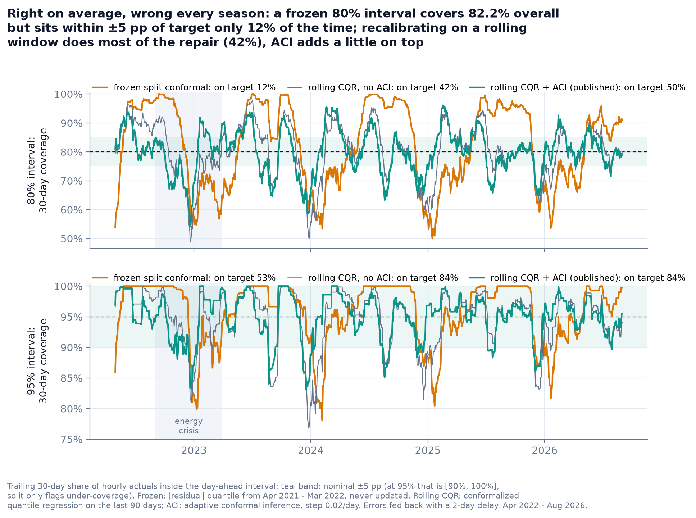
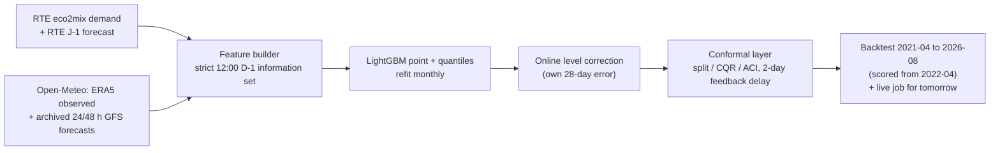
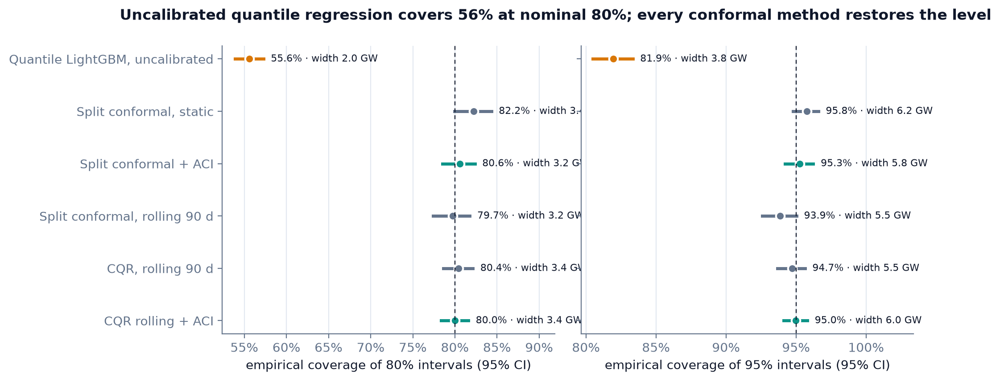
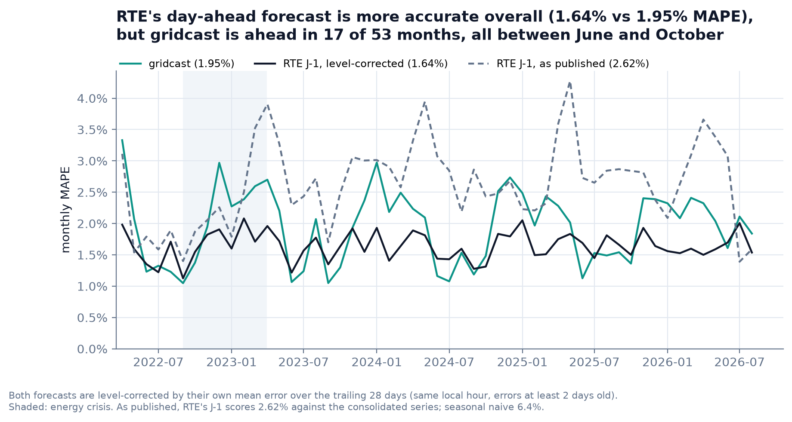
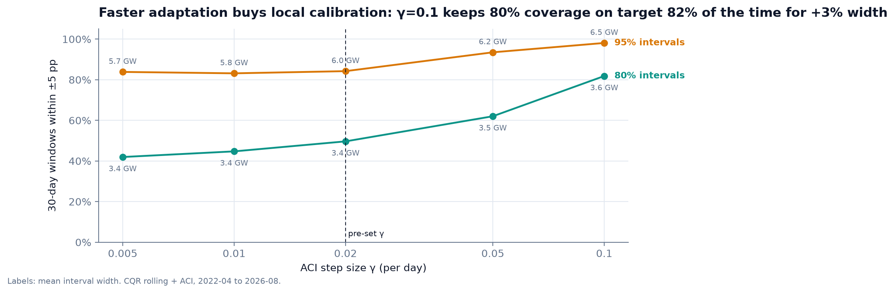
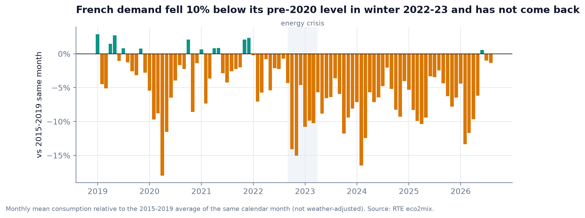
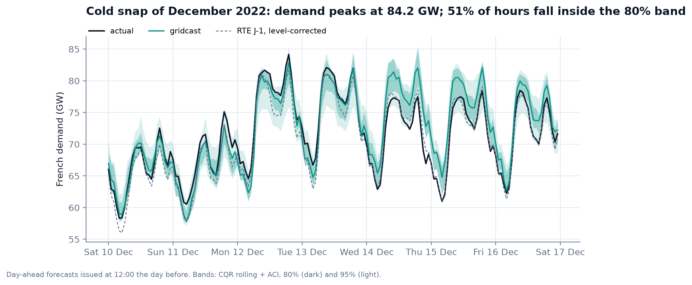
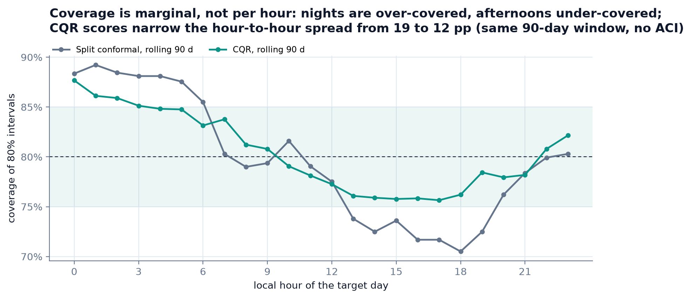

# gridcast

Can a day-ahead forecast of French electricity demand publish uncertainty bands that stay honest through an energy crisis? On average yes, month to month only partly: a measured answer from 38,732 hourly forecasts scored out of sample.

[](https://github.com/Pchambet/gridcast/actions/workflows/ci.yml)
[](https://www.python.org/)
[](LICENSE)
[](https://pchambet.github.io/gridcast/)



## TL;DR

- **Calibrated on average, by construction.** Over 38,732 hourly day-ahead forecasts (April 2022 to August 2026, scored out of sample), the published 80% and 95% intervals cover **80.0%** [78.4, 81.6] and **95.0%** [94.1, 95.8] of actual demand. The same quantile model without conformal calibration covers **55.6%** at nominal 80% (57.6% even when fed observed weather, so the weather-forecast mismatch explains little of it).
- **Average coverage hides seasonal failure.** A split-conformal interval calibrated once on April 2021 to March 2022 still covers 82.2% overall, but its trailing 30-day coverage is within ±5 pp of target only **12%** of the time, swinging from 50% to 100%.
- **Recalibrating on a rolling window does most of the repair.** Rolling 90-day conformalized quantile regression (CQR) is on target **42%** of the time at 80%; adding adaptive conformal inference (ACI) at the pre-set step lifts that to **50%**, for the same interval (Winkler) score (4.85 vs 4.82 GW), 7% below the frozen interval's. At 95%, where "on target" can only mean 30-day coverage ≥ 90%, ACI adds nothing (84% either way) and costs wider bands (5.53 to 5.98 GW) and a worse Winkler score (7.14 to 7.33 GW).
- **The crisis is still hard.** Over September 2022 to March 2023, when demand ran about 10% below its 2015-2019 level (not weather-adjusted), the published 80% interval covered **77.3%**.
- **RTE's own forecast is more accurate, once compared fairly.** Scored naively, both as produced, gridcast beats RTE's published J-1 forecast: 2.08% vs 2.62% MAPE. But since 2023 RTE's forecast runs about 2% below the consolidated series it is scored against, a gap public data cannot attribute to definitions or to forecast error. With the same online level correction applied to both, RTE wins: **1.64%** vs **1.95%** MAPE (difference +0.30 pp, 95% CI [+0.21, +0.40]). gridcast is still ahead in 17 of 53 months, all between June and October.

## Why it matters

A grid operator, a supplier or a flexibility aggregator does not schedule on a point forecast; it schedules reserves, hedges and demand response against the tails. An 80% band that is right on average but covers 55% of hours in a cold December is worse than no band: it invites confident decisions exactly when they hurt. This project measures how well distribution-free intervals hold up under a real, documented distribution shift, using only public data and an information set that a forecaster really had at the time.

## Approach



1. **Information set.** The forecast for local day D is issued at 12:00 Europe/Paris on D-1. Demand is known up to 11:00 (one hour publication lag). Weather comes from an archive of forecasts issued 24 h and 48 h ahead: the 24 h value is used only if its model run finished at least 4 h before the issue time, otherwise the 48 h value. Tests replace every value unknowable at issue time with garbage and check that the features, the monthly backtest refit and the live forecast do not move. Two inputs are nevertheless better than what was available at the time; see the limitations.
2. **Features.** Calendar and French holidays (including bridge days), demand on the local wall clock (same hour 2 and 7 days earlier, DST-safe), a holiday-aware similar-day anchor scaled by the latest week-over-week level drift, and a population-weighted national temperature from the ten largest metro areas with exponential smoothing for thermal inertia. Forecast temperatures are bias-corrected per hour on a trailing 60-day window: raw GFS runs up to 1.3 °C warm at night against ERA5, and the correction removes that bias and cuts night-time absolute error by about a quarter.
3. **Model.** LightGBM (L2 point model + 2.5/10/90/97.5% quantiles), refit every month on all past days with observed weather, predicting with forecast weather. Hyperparameters fixed a priori, not tuned. The features were designed knowing that French demand dropped in 2022 (the week-ratio feature exists to absorb such level shifts), so the backtest is not blind to that design choice.
4. **Level correction.** The point forecast and its quantiles are shifted by their own mean error over the trailing 28 days at the same local hour, using errors at least two days old. RTE's forecast receives exactly the same treatment for the benchmark.
5. **Conformal layer.** Six interval methods share the same forecasts: uncalibrated quantiles, split conformal (frozen or rolling 90 days), CQR (rolling 90 days), and ACI (Gibbs & Candès, 2021) on top of frozen split and rolling CQR. Errors of day D are fed back from D+2 on, since the forecast for D+1 is issued before D ends.
6. **Evaluation.** April 2021 to March 2022 is a calibration burn-in; everything is scored on April 2022 to August 2026. Confidence intervals come from a week-block bootstrap (1,000 resamples), because hourly errors are strongly autocorrelated.

## Results

**Interval methods** (2022-04-01 to 2026-08-31; Winkler = interval score, lower is better):

<!-- BEGIN:interval-table -->
| Method | 80% coverage [95% CI] | width (GW) | Winkler (GW) | 95% coverage [95% CI] | width (GW) | Winkler (GW) |
|---|---|---|---|---|---|---|
| Quantile LightGBM, uncalibrated | 55.6% [53.9%, 57.3%] | 2.01 | 5.49 | 81.9% [80.5%, 83.3%] | 3.79 | 8.78 |
| Split conformal, static | 82.2% [79.9%, 84.3%] | 3.39 | 5.17 | 95.8% [94.8%, 96.6%] | 6.24 | 7.97 |
| Split conformal + ACI | 80.6% [78.5%, 82.4%] | 3.19 | 4.89 | 95.3% [94.2%, 96.2%] | 5.75 | 7.59 |
| Split conformal, rolling 90 d | 79.7% [77.4%, 81.8%] | 3.23 | 5.02 | 93.9% [92.6%, 95.0%] | 5.49 | 7.73 |
| CQR, rolling 90 d | 80.4% [78.6%, 82.1%] | 3.35 | 4.85 | 94.7% [93.7%, 95.6%] | 5.53 | 7.14 |
| CQR rolling + ACI | 80.0% [78.4%, 81.6%] | 3.44 | 4.82 | 95.0% [94.1%, 95.8%] | 5.98 | 7.33 |
<!-- END:interval-table -->

Every conformal variant fixes the gross under-coverage of raw quantile regression; they differ in how evenly they deliver it over time.



**Point accuracy** (MAPE with week-block bootstrap CI; last column: difference to the level-corrected RTE forecast):

<!-- BEGIN:point-table -->
| Forecast | MAPE [95% CI] | RMSE (GW) | MAPE, crisis | vs RTE corrected [95% CI] |
|---|---|---|---|---|
| gridcast | 1.95% [1.85%, 2.05%] | 1.41 | 2.09% | +0.30 pp [+0.21, +0.40] |
| gridcast, no level correction | 2.08% [1.97%, 2.20%] | 1.51 | 2.54% | +0.43 pp [+0.33, +0.55] |
| RTE J-1, level-corrected | 1.64% [1.58%, 1.70%] | 1.09 | 1.68% | — |
| RTE J-1, as published | 2.62% [2.51%, 2.73%] | 1.65 | 2.20% | +0.98 pp [+0.88, +1.09] |
| Seasonal naive (D-7) | 6.41% [5.83%, 7.10%] | 5.02 | 8.08% | +4.76 pp [+4.19, +5.42] |
| gridcast with observed weather (oracle) | 1.85% [1.76%, 1.95%] | 1.32 | 2.05% | +0.21 pp [+0.12, +0.30] |
<!-- END:point-table -->

RTE leads overall and in each of the three periods, though not significantly in the five pre-crisis months (+0.26 pp, 95% CI [-0.04, +0.58]), where the level correction even costs gridcast 0.12 pp (1.83% vs 1.71% uncorrected). gridcast beats the corrected RTE forecast in 17 of 53 months, all between June and October, when demand is flat and temperature-driven. Perfect weather would close about a third of the gap; the rest likely comes from richer inputs (cloud cover, embedded solar, many more stations), RTE's possibly later issue time, and model capacity.



**Adaptation speed.** The ACI step size γ trades local calibration for width. Over 2022-2026, γ = 0.1 instead of the pre-set 0.02 keeps 80% coverage on target 82% of the time, for 3% wider intervals and a worse Winkler score (4.82 to 4.92 GW at 80%, 7.33 to 7.67 GW at 95%). Over the crisis alone it lifts 80% coverage from 77.3% to 79.7%, for 17% wider intervals and a 7% worse Winkler score. This is an in-sample sensitivity on the test window, not a validated choice, so the published method keeps γ = 0.02:



**The shift itself**, and what a week of it looks like:





**Coverage is marginal, not conditional.** Nights are over-covered and afternoons under-covered; with the same rolling window and no ACI, CQR scores narrow the spread across hours but do not remove it:



## Forecasting tomorrow

`make live` runs the backtest protocol on today's data: it refreshes the data, retrains, forecasts the next day with 80% and 95% intervals, appends the forecast to a local `forecast_log.csv`, scores every past forecast whose outcome is now published (coverage, MAPE against RTE's J-1 on the real-time feed), and adds a "Tomorrow" section with the running track record to the local report page. The job is stateless: the conformal state is replayed from the log on each run, so there is no hidden state to drift. Days missing from the log (before the first run, or after a gap) are hindcast with the backtest protocol and stored as such, so calibration never runs dry; they are excluded from the track record, and the job fails rather than publish a forecast without intervals.

## Reproduce

```bash
make setup     # uv sync --locked (Python 3.12)
make data      # ~2 min, ~12 MB: eco2mix demand + Open-Meteo weather, cached in data/raw
make run       # backtest (65 monthly refits, 25-40 min on 3 cores) + evaluate + figures
make report    # site/index.html, and refreshes the generated README tables
```

`make test` runs the test suite offline in under a minute. All numbers above come from `data/results/` (committed) and are regenerated by `make run`. LightGBM runs in deterministic mode. On one machine, two full backtests (before and after that switch) produced forecasts identical to within 1e-7 MW and byte-identical result tables; other machines have not been checked. The backtest window is frozen in `src/gridcast/config.py`, so newer data does not change them.

## Repository layout

```
src/gridcast/
  config.py      every design constant: periods, issue time, cities, gamma, model params
  data.py        cached downloads (ODRE eco2mix, Open-Meteo) -> hourly UTC table
  infoset.py     issue time, demand cutoff, weather-lead rule (the only place "when" lives)
  features.py    leakage-tested feature builder (wall-clock lags, MOS, thermal inertia)
  models.py      LightGBM point/quantile models, level correction
  backtest.py    monthly rolling-origin refits with checkpoints
  conformal.py   split, CQR, ACI with delayed feedback
  metrics.py     MAPE, Winkler, pinball, week-block bootstrap
  evaluate.py    result tables and summary.json
  figures.py     README figures      report.py   report page
  live.py        tomorrow's forecast and forecast log
tests/           leakage (features, backtest refit, live job), DST, conformal coverage,
                 ACI under shift and clipping, model ground truth, live log and hindcast
data/results/    small committed result tables
docs/figures/    committed figures
```

## Methodology notes and limitations

- **The backtest knows more than the live job.** Demand lags, the level correction and conformal feedback use RTE's consolidated series, published months later; at issue time only the real-time vintage existed. That effect cannot be measured: the consolidated and real-time files do not overlap. Observed temperature before the issue time is ERA5 reanalysis, a proxy for station observations that arrives about 5.5 days late. Masking those days as the live job must changes almost nothing: MAPE 1.946% vs 1.949%, published 80% coverage 80.03% in both cases (`data/results/information_sets.csv`).
- **Weather inputs.** Only 2 m temperature has archived day-ahead forecasts before 2024 in the open archive (GFS from March 2021); cloud cover, wind and irradiance, which matter for lighting and embedded solar, are not used. 516 hours (21.5 days, 30 Dec 2023 00:00 to 20 Jan 2024 11:00 UTC) are missing from the GFS archive and filled with JMA forecasts, the only archived model covering them; they are flagged in the hourly table.
- **Train/predict mismatch.** The model is trained on reanalysis (ERA5) temperature and predicts with forecasts. The conformal layer absorbs the extra error in the intervals; the point forecast pays for it (1.85% MAPE with observed weather vs 1.95%). The uncalibrated quantiles ignore weather-forecast error by construction, but fed observed weather they still cover only 57.6% at nominal 80%.
- **RTE comparison.** Since 2023 RTE's J-1 runs about 2% below the consolidated demand series, with a strong hour profile: -4.3% at midnight and around 15:00, +0.5% at 06:00 (`data/results/rte_bias_by_hour.csv`). On the only real-time data in the backtest (July-August 2026, 1,488 hours) its bias is +0.3%, too short to conclude. Whether the gap is definitional or forecast bias cannot be separated with public data, so both forecasters are level-corrected identically and both raw scores are reported. RTE's J-1 may be published later than 12:00 on D-1, which slightly favours RTE. The last two backtest months and any live track record are scored on the real-time feed, not the consolidated series the model is trained on.
- **What the guarantee covers.** Conformal coverage here is marginal over hours. It is not conditional on hour, weather regime or season, and the hourly errors within a day are dependent, so the effective sample is closer to days than hours. The block bootstrap accounts for this in the confidence intervals. ACI's long-run bound (Gibbs & Candès) assumes unclipped, per-step updates; here alpha_t is clipped (the interval is capped at the largest calibration score, on 26 scored days for the published 95% interval) and updated once a day with a two-day delay, so the bound is only approximate. Empirically: 80.0% and 95.0%.
- **"On target".** A 30-day window is on target within ±5 pp of nominal. At 95% that band is [90%, 100%], so it only flags under-coverage: on-target shares at 80% and 95% are not comparable.
- **Pre-set choices.** γ = 0.02/day, the 90-day window and the 28-day level-correction window were fixed before scoring; the γ sensitivity is reported in full rather than tuned, and it is in-sample. The level correction was added after seeing that RTE's published forecast is biased against the consolidated series, and is applied symmetrically. The features were designed knowing that French demand dropped in 2022, and no development split is committed, so feature design is not out of sample.
- **Population weights** for the national temperature use INSEE 2020 metropolitan-area populations (2017 census), rounded.
- **Live timing.** `make live` enforces the demand cutoff whenever it runs, but its weather forecast comes from the latest model run, which may have finished after the nominal 12:00 issue time.

## References

- Gibbs, I. & Candès, E. (2021). *Adaptive conformal inference under distribution shift.* NeurIPS.
- Romano, Y., Patterson, E. & Candès, E. (2019). *Conformalized quantile regression.* NeurIPS.
- Vovk, V., Gammerman, A. & Shafer, G. (2005). *Algorithmic Learning in a Random World.* Springer.
- Gneiting, T. & Raftery, A. (2007). *Strictly proper scoring rules, prediction, and estimation.* JASA.
- Chernozhukov, V., Fernández-Val, I. & Galichon, A. (2010). *Quantile and probability curves without crossing.* Econometrica.
- RTE eco2mix national data via [ODRÉ](https://odre.opendatasoft.com/) (`eco2mix-national-cons-def`, `eco2mix-national-tr`), Licence Ouverte / Etalab 2.0.
- [Open-Meteo](https://open-meteo.com/) Historical Weather (ERA5, Hersbach et al., 2020) and Previous Runs APIs, CC BY 4.0.
- INSEE, *Aires d'attraction des villes 2020*.

---

Built by [Pierre Chambet](https://github.com/Pchambet) — decision science for operations under uncertainty.
