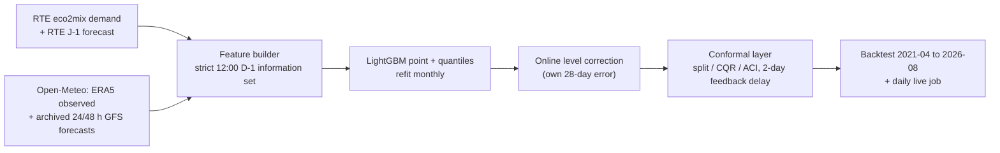

# gridcast

Can a day-ahead forecast of French electricity demand publish uncertainty bands that stay honest through an energy crisis? Yes on average, only partly month to month, and here is the measured trade-off, re-run every day in public.

[](https://github.com/Pchambet/gridcast/actions/workflows/ci.yml)
[](https://www.python.org/)
[](LICENSE)
[](https://pchambet.github.io/gridcast/)


## TL;DR

- **Calibrated on average, by construction.** Over 38,732 hourly day-ahead forecasts (April 2022 to August 2026, scored out of sample), the published 80% and 95% intervals cover **80.0%** [78.4, 81.6] and **95.0%** [94.1, 95.8] of actual demand. The same quantile model without conformal calibration covers **55.6%** at nominal 80%.
- **Average coverage hides seasonal failure.** A split-conformal interval calibrated once on April 2021 to March 2022 still covers 82.2% overall, but its trailing 30-day coverage is within ±5 pp of target only **12%** of the time (swinging from 50% to 100%). Rolling conformalized quantile regression with adaptive conformal inference (CQR + ACI) is on target **50%** of the time at 80% and **84%** at 95%, with a 7% lower interval (Winkler) score.
- **The crisis is still hard.** Over September 2022 to March 2023 (in the crisis winter demand ran about 10% below its 2015-2019 level), the published 80% interval covered **77.3%**. A faster ACI step (γ = 0.1 instead of the pre-set 0.02) keeps 30-day coverage on target 82% of the time for 3% wider intervals.
- **RTE's own forecast is more accurate, once compared fairly.** Scored naively, gridcast beats RTE's published J-1 forecast (1.95% vs 2.62% MAPE). That is an artefact: since 2023 RTE's forecast sits about 2% below the consolidated demand series, while it is unbiased on the real-time feed. With the same online level correction applied to both, RTE wins: **1.64%** vs **1.95%** MAPE (difference +0.30 pp, 95% CI [+0.21, +0.40]).

## Why it matters

A grid operator, a supplier or a flexibility aggregator does not schedule on a point forecast; it schedules reserves, hedges and demand response against the tails. An 80% band that is right on average but covers 55% of hours in a cold December is worse than no band: it invites confident decisions exactly when they hurt. This project measures how well distribution-free intervals hold up under a real, documented distribution shift, using only public data and an information set that a forecaster really had at the time.

## Approach



1. **Information set.** The forecast for local day D is issued at 12:00 Europe/Paris on D-1. Demand is known up to 11:00 (one hour publication lag). Weather comes from an archive of forecasts issued 24 h and 48 h ahead: the 24 h value is used only if its model run finished at least 4 h before the issue time, otherwise the 48 h value. A test replaces every value unknowable at issue time with garbage and checks that the features do not move.
2. **Features.** Calendar and French holidays (including bridge days), demand on the local wall clock (same hour 2 and 7 days earlier, DST-safe), a holiday-aware similar-day anchor scaled by the latest week-over-week level drift, and a population-weighted national temperature from the ten largest metro areas with exponential smoothing for thermal inertia. Forecast temperatures are bias-corrected per hour on a trailing 60-day window: raw GFS runs up to 1.3 °C warm at night against ERA5, and the correction removes that bias and cuts night-time absolute error by about a quarter.
3. **Model.** LightGBM (L2 point model + 2.5/10/90/97.5% quantiles), refit every month on all past days with observed weather, predicting with forecast weather. Hyperparameters fixed a priori; feature design chosen on 2019 to early 2021, before the backtest window.
4. **Level correction.** The point forecast and its quantiles are shifted by their own mean error over the trailing 28 days at the same local hour, using errors at least two days old. RTE's forecast receives exactly the same treatment for the benchmark.
5. **Conformal layer.** Six interval methods share the same forecasts: uncalibrated quantiles, split conformal (frozen or rolling 90 days), CQR (rolling 90 days), and ACI (Gibbs & Candès, 2021) on top of frozen split and rolling CQR. Errors of day D are fed back from D+2 on, since the forecast for D+1 is issued before D ends.
6. **Evaluation.** April 2021 to March 2022 is a calibration burn-in; everything is scored on April 2022 to August 2026. Confidence intervals come from a week-block bootstrap (1,000 resamples), because hourly errors are strongly autocorrelated.

## Results

**Interval methods** (2022-04-01 to 2026-08-31; Winkler = interval score, lower is better):

<!-- BEGIN:interval-table -->
| Method | 80% coverage [95% CI] | width (GW) | Winkler (GW) | 95% coverage [95% CI] | width (GW) | Winkler (GW) |
|---|---|---|---|---|---|---|
| Quantile LightGBM, uncalibrated | 55.6% [53.9%, 57.3%] | 2.01 | 5.49 | 81.9% [80.5%, 83.3%] | 3.79 | 8.78 |
| Split conformal, static | 82.2% [79.9%, 84.3%] | 3.39 | 5.17 | 95.8% [94.8%, 96.6%] | 6.24 | 7.97 |
| Split conformal + ACI | 80.6% [78.5%, 82.4%] | 3.19 | 4.89 | 95.3% [94.2%, 96.2%] | 5.75 | 7.59 |
| Split conformal, rolling 90 d | 79.7% [77.4%, 81.8%] | 3.23 | 5.02 | 93.9% [92.6%, 95.0%] | 5.49 | 7.73 |
| CQR, rolling 90 d | 80.4% [78.6%, 82.1%] | 3.35 | 4.85 | 94.7% [93.7%, 95.6%] | 5.53 | 7.14 |
| CQR rolling + ACI | 80.0% [78.4%, 81.6%] | 3.44 | 4.82 | 95.0% [94.1%, 95.8%] | 5.98 | 7.33 |
<!-- END:interval-table -->

Every conformal variant fixes the gross under-coverage of raw quantile regression; they differ in how evenly they deliver it over time.


**Point accuracy** (MAPE with week-block bootstrap CI; last column: difference to the level-corrected RTE forecast):

<!-- BEGIN:point-table -->
| Forecast | MAPE [95% CI] | RMSE (GW) | MAPE, crisis | vs RTE corrected [95% CI] |
|---|---|---|---|---|
| gridcast | 1.95% [1.85%, 2.05%] | 1.41 | 2.09% | +0.30 pp [+0.21, +0.40] |
| gridcast, no level correction | 2.08% [1.97%, 2.20%] | 1.51 | 2.54% | +0.43 pp [+0.33, +0.55] |
| RTE J-1, level-corrected | 1.64% [1.58%, 1.70%] | 1.09 | 1.68% | — |
| RTE J-1, as published | 2.62% [2.51%, 2.73%] | 1.65 | 2.20% | +0.98 pp [+0.88, +1.09] |
| Seasonal naive (D-7) | 6.41% [5.83%, 7.10%] | 5.02 | 8.08% | +4.76 pp [+4.19, +5.42] |
| gridcast with observed weather (oracle) | 1.85% [1.76%, 1.95%] | 1.32 | 2.05% | +0.21 pp [+0.12, +0.30] |
<!-- END:point-table -->

RTE leads in every period; perfect weather would close about a third of the gap, the rest is inputs gridcast does not have (cloud cover, embedded solar, many more stations).


**Adaptation speed.** The ACI step size γ is the one knob that trades local calibration for width:


**The shift itself**, and what a week of it looks like:


**Coverage is marginal, not conditional.** Nights are over-covered and afternoons under-covered; CQR narrows the spread across hours but does not remove it:


## Live forecast

`.github/workflows/daily.yml` runs every day at 11:30 UTC: it refreshes the data, retrains, forecasts the next day with 80% and 95% intervals, appends the forecast to `forecast_log.csv` on the orphan branch `live-data`, scores every past forecast whose outcome is now published (coverage, MAPE against RTE's J-1 on the real-time feed), and redeploys the [report page](https://pchambet.github.io/gridcast/). The job is stateless: the conformal state is replayed from the log each day, so there is no hidden state to drift. `make live` runs the same job locally.

## Reproduce

```bash
make setup     # uv sync --locked (Python 3.12)
make data      # ~2 min, ~12 MB: eco2mix demand + Open-Meteo weather, cached in data/raw
make run       # backtest (65 monthly refits, 25-40 min on 3 cores) + evaluate + figures
make report    # site/index.html, and refreshes the generated README tables
```

`make test` runs the test suite offline in under a minute. All numbers above come from `data/results/` (committed) and are regenerated by `make run`; two independent runs of the full backtest produced identical results. The backtest window is frozen in `src/gridcast/config.py`, so newer data does not change them.

## Repository layout

```
src/gridcast/
  config.py      every design constant: periods, issue time, cities, gamma, model params
  data.py        cached downloads (ODRE eco2mix, Open-Meteo) -> hourly UTC table
  infoset.py     issue time, demand cutoff, weather-lead rule (the only place "when" lives)
  features.py    leakage-tested feature builder (wall-clock lags, MOS, thermal inertia)
  models.py      LightGBM point/quantile models, level correction
  backtest.py    monthly rolling-origin refits with checkpoints
  conformal.py   split, CQR, ACI with delayed feedback
  metrics.py     MAPE, Winkler, pinball, week-block bootstrap
  evaluate.py    result tables and summary.json
  figures.py     README figures      report.py   report page
  live.py        daily job and forecast log
tests/           information set, DST, conformal coverage, ACI under shift, live log
data/results/    small committed result tables
docs/figures/    committed figures
```

## Methodology notes and limitations

- **Weather inputs.** Only 2 m temperature has archived day-ahead forecasts before 2024 in the open archive (GFS from March 2021); cloud cover, wind and irradiance, which matter for lighting and embedded solar, are not used. Twenty days (30 Dec 2023 to 19 Jan 2024) are missing from the GFS archive and are filled with JMA forecasts, the only archived model covering them.
- **Train/predict mismatch.** The model is trained on reanalysis (ERA5) temperature and predicts with forecasts. The conformal layer absorbs the extra error in the intervals; the point forecast pays for it (1.85% MAPE with observed weather vs 1.95%).
- **RTE comparison.** RTE's consolidated demand and its J-1 forecast diverge by about 2% since 2023; whether that is definitional or forecast bias cannot be separated with public data, so both forecasters are level-corrected identically and both raw scores are reported. RTE's J-1 may be published later than 12:00 on D-1, which slightly favours RTE. The last two backtest months and the live track record are scored on the real-time feed, not the consolidated series the model is trained on.
- **What the guarantee covers.** Conformal coverage here is marginal over hours. It is not conditional on hour, weather regime or season, and the hourly errors within a day are dependent, so the effective sample is closer to days than hours. The block bootstrap accounts for this in the confidence intervals.
- **Pre-set choices.** γ = 0.02/day, the 90-day window and the 28-day level-correction window were fixed before scoring; the γ sensitivity is reported in full rather than tuned. The level correction was added after seeing that RTE's published forecast is biased against the consolidated series, and is applied symmetrically.
- **Population weights** for the national temperature use INSEE 2020 metropolitan-area populations (2017 census), rounded.
- **Live timing.** The daily job runs at 11:30 UTC, after the 12:00 Paris issue time in winter (by 30 min) and summer (by 90 min); it enforces the demand cutoff, but its weather forecast may come from a run finished slightly after the nominal issue time.

## References

- Gibbs, I. & Candès, E. (2021). *Adaptive conformal inference under distribution shift.* NeurIPS.
- Romano, Y., Patterson, E. & Candès, E. (2019). *Conformalized quantile regression.* NeurIPS.
- Vovk, V., Gammerman, A. & Shafer, G. (2005). *Algorithmic Learning in a Random World.* Springer.
- Gneiting, T. & Raftery, A. (2007). *Strictly proper scoring rules, prediction, and estimation.* JASA.
- Chernozhukov, V., Fernández-Val, I. & Galichon, A. (2010). *Quantile and probability curves without crossing.* Econometrica.
- RTE eco2mix national data via [ODRÉ](https://odre.opendatasoft.com/) (`eco2mix-national-cons-def`, `eco2mix-national-tr`), Licence Ouverte / Etalab 2.0.
- [Open-Meteo](https://open-meteo.com/) Historical Weather (ERA5, Hersbach et al., 2020) and Previous Runs APIs, CC BY 4.0.
- INSEE, *Aires d'attraction des villes 2020*.

---

Built by [Pierre Chambet](https://github.com/Pchambet) — decision science for operations under uncertainty.
